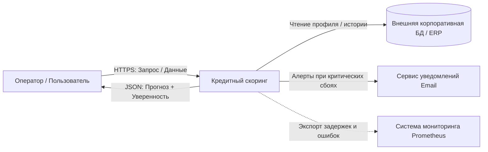
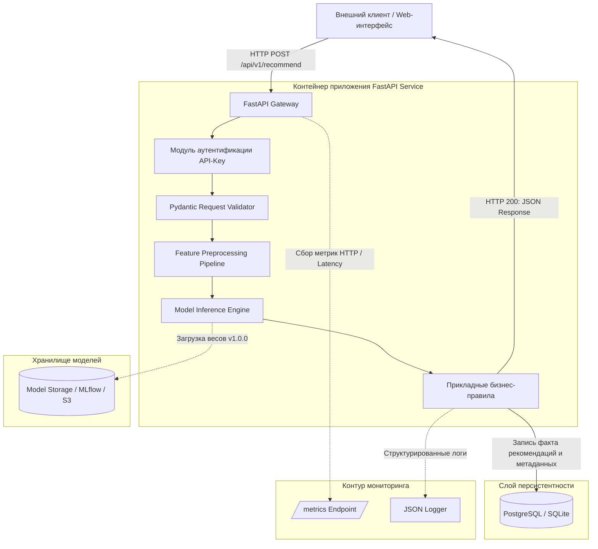

# ai-system-credit-scoring

### Бизнес-цель ###
Сервис решает проблему автоматической оценки кредитоспособности заемщика (физического лица) на основе его финансовых данных.

#### Конечный пользователь 
- Кредитный специалист - получает вероятностную оценку риска и объяснение для принятия финального решения.
- Внешняя учетная система - получает программный вердикт для автоматического одобрения/отказа.

### Метрики эффективности

#### Метрики бизнес-процесса
- Сокращение времени обработки заявки с 20 минут до 30 секунд.
- Снижение доли одобренных кредитов, по которым возникла просрочка, на 15%

#### Технические метрики
- Время ответа сервиса < 200 мс
- Доступность сервиса — 99.9%

#### Метрики бизнес-процесса
- Precision ≥ 0.85
- F1-score ≥ 0.80

### Границы системы (Scope)
- Валидация данных, инференс, логирование, приложение, локальное хранение данных.
- Бухгалтерские проводки, физическое управление станками, юридическое утверждение приказов.

### Таблица требований
| Тип требования | Формулировка требования | Критерий приемки |
|------|-----|-----|
| Функциональное (FR-01) | Прием кредитной заявки | Эндпоинт принимает валидный JSON с финансовыми и социально-демографическими признаками. |
| Функциональное (FR-02) | Оценка вероятности дефолта | Система возвращает вероятность и текстовый вердикт. |
| Функциональное (FR-03) | Фильтрация невалидных данных | При нарушении схемы возвращается статус 400 Bad Request с указанием поля. |
| Функциональное (FR-04) | Fallback на человека | При уверенности модели < 0.75 получить ответ от оператора о рекомендации. |
| Нефункциональное (NFR-01) | Производительность | Время инференса одного объекта на CPU не превышает 150 мс. |
| Нефункциональное (NFR-02) | Воспроизводимость | Каждый ответ модели содержит метаданные версии и номера ответа. |
| Нефункциональное (NFR-03) | Безопасность | Персональные данные заемщиков анонимизированы. |

### Контекстная диаграмма



### Описание информационных потоков

| Поток | Протокол | Частота обращений | Формат полезной нагрузки |
| :--- | :--- | :--- | :--- |
| Пользователь → Система | HTTPS (REST) | По запросу | JSON |
| Система → Пользователь | HTTPS (REST) | По запросу | JSON |
| Система → Корпоративная БД | SQL / REST | При каждом запросе | SQL-запрос |
| Система → Сервис уведомлений | HTTPS (Webhook) | Только при критических сбоях | JSON |
| Система → Prometheus | HTTP (pull) | Каждые 15 секунд (scrape interval) | Метрики в формате Prometheus |

### Компонентная декомпозиция 



## Описание компонентов

| Компонент | Назначение | Технологии |
|---|---|---|
| API Gateway | Точка входа, маршрутизация запросов, аутентификация по API-ключу. | FastAPI + Uvicorn |
| Модуль валидации | Проверка типов, диапазонов значений, обязательных полей. | Pydantic |
| Модуль предобработки | Нормализация, энкодинг категориальных признаков, расчет производных метрик. | pandas, scikit-learn |
| Модуль инференса | Загрузка весов модели и выполнение предсказания вероятности дефолта. | scikit-learn / LightGBM |
| Прикладная логика | Сравнение уверенности с порогом, применение бизнес-правил, формирование вердикта. | Python |
| Слой хранения | Сохранение логов, фактов инференса, метаданных, аудит-трейла. | SQLite / PostgreSQL |
| Хранилище артефактов | Хранение версий моделей, весов, конфигураций. | Локальный каталог / MinIO / MLflow |
| Модуль наблюдаемости | Сбор логов в JSON и метрик для Prometheus. | prometheus-client, logging |

## Таблица компонентов

| Компонент | Назначение модуля | Входные данные | Выходные данные | Используемые библиотеки |
|---|---|---|---|---|
| app.api.routes | Обработка HTTP-запросов к API скоринга | HTTP Request | HTTP Response | fastapi, starlette |
| app.api.schemas | Pydantic-схемы валидации: заявка, ответ, SHAP | JSON Raw Payload | Строго типизированный объект | pydantic |
| app.ml.preprocessing | Трансформация признаков: энкодинг категорий, нормализация доходов и долговой нагрузки | Словарь признаков | NumPy array / DataFrame | numpy, scikit-learn, pandas |
| app.ml.inference | Получение от модели вероятности дефолта | Подготовленные фичи | Числовое предсказание (PD) | scikit-learn, lightgbm, joblib |
| app.services.prediction | Оркестрация бизнес-правил: порог уверенности, вердикт | Сырой запрос + PD + SHAP | Готовый бизнес-результат | Чистый Python |
| app.repositories | Персистентность фактов прогноза и аудит-трейла | Сущность прогноза | Запись в БД | sqlalchemy, aiosqlite |

## Спецификация контрактов REST API

### Заголовки

```
Content-Type: application/json
X-API-Key: <secret_token>
```

### Схема входных данных (Pydantic)

```
from pydantic import BaseModel, Field


class CreditApplication(BaseModel):
    application_id: str = Field(description="Уникальный идентификатор кредитной заявки")
    age: int = Field(ge=18, le=100, description="Возраст заемщика")
    income: float = Field(ge=0.0, description="Ежемесячный доход, руб.")
    debt_ratio: float = Field(ge=0.0, le=1.0, description="Долговая нагрузка (DTI)")
    credit_history_length: int = Field(ge=0, description="Длина кредитной истории, мес.")
    num_late_payments: int = Field(ge=0, description="Количество просрочек за последние 2 года")
    num_open_loans: int = Field(ge=0, description="Количество открытых кредитов")
    employment_length: int = Field(ge=0, description="Стаж на текущем месте, мес.")

    class Config:
        json_schema_extra = {
            "example": {
                "application_id": "APP_2024_000123",
                "age": 34,
                "income": 85000.0,
                "debt_ratio": 0.35,
                "credit_history_length": 96,
                "num_late_payments": 0,
                "num_open_loans": 2,
                "employment_length": 48
            }
        }
```

### Схема успешного ответа (200 OK)

```
class ShapFeature(BaseModel):
    feature: str = Field(description="Имя признака")
    contribution: float = Field(description="Вклад признака в решение (SHAP value)")


class ScoringResponse(BaseModel):
    request_id: str = Field(description="Уникальный идентификатор запроса (UUIDv4) для аудита")
    application_id: str = Field(description="Идентификатор кредитной заявки")
    prediction: str = Field(description="Вердикт: 'APPROVED', 'REJECTED', 'MANUAL_REVIEW'")
    probability_of_default: float = Field(ge=0.0, le=1.0, description="Вероятность дефолта (PD)")
    model_version: str = Field(description="Семантическая версия используемой модели")
    manual_review_required: bool = Field(description="Флаг необходимости проверки андеррайтером")
    top_features: list[ShapFeature] = Field(description="ТОП-5 признаков, повлиявших на решение (SHAP)")
```

### Пример тела успешного ответа

```
{
  "request_id": "9b1deb4d-3b7d-4bad-9bdd-2b0d7b3dcb6d",
  "application_id": "APP_1",
  "prediction": "APPROVED",
  "probability_of_default": 0.12,
  "model_version": "1.0.0",
  "manual_review_required": false,
  "top_features": [
    { "feature": "debt_ratio", "contribution": -0.18 },
    { "feature": "num_late_payments", "contribution": -0.15 },
    { "feature": "income", "contribution": 0.11 },
    { "feature": "credit_history_length", "contribution": 0.07 },
    { "feature": "age", "contribution": -0.03 }
  ]
}
```

### Спецификация ошибок валидации (400 / 422 Bad Request)

```
{
  "error": "VALIDATION_FAILED",
  "detail": [
    {
      "field": "debt_ratio",
      "message": "Value must be less than or equal to 1.0"
    }
  ]
}
```

### Системные эндпоинты

`GET /health` — проверка состояния сервиса

```
{
  "status": "healthy",
  "model_loaded": true,
  "model_version": "1.0.0",
  "uptime_seconds": 3600
}
```

## ADR-01: Выбор режима инференса (Synchronous REST API vs Asynchronous Message Queue)

**Статус:** Принято (Accepted)

**Контекст:**Специалист ожидает результат в реальном времени, так как от этого зависит решение по заявке клиента, находящегося у окна. Альтернатива — асинхронная обработка через очередь - потребовала бы отдельного брокера и усложнила бы интеграцию с существующей системой, которая работает по синхронному HTTP.

**Рассмотренные альтернативы:**
1. Synchronous REST API  - клиент отправляет запрос и ждёт ответа.
2. Asynchronous Message Queue - клиент публикует задачу, сервис обрабатывает её в фоне, результат возвращается через callback или polling.

**Решение:** Выбран Synchronous REST API на FastAPI.

**Обоснование:** Время инференса модели составляет единицы миллисекунд, что укладывается в нормы. Синхронный API проще в отладке, легко интегрируется с системой. Асинхронная очередь дала бы выигрыш только при пакетной обработке больших объемов.

**Последствия:** Преимущества: простота реализации, низкая задержка, лёгкая отладка, автоматическая валидация. 
Риски: при резком росте нагрузки потребуется горизонтальное масштабирование или переход на асинхронную обработку.

## ADR-02: Стратегия хранения и версионирования моделей и артефактов

**Статус:** Принято (Accepted)
**Контекст:** Модель кредитного скоринга переобучается ежемесячно по мере накопления новых данных о дефолтах. Каждое обновление создаёт новую версию весов, которые могут весить сотни мегабайт. Возникает вопрос: где хранить, чтобы обеспечить воспроизводимость и возможность отката к предыдущей версии?

  ### ADR-02: Стратегия хранения и версионирования моделей и артефактов

- **Статус:** Принято (Accepted)
- **Контекст:** 
  ML-модель рекомендаций образов периодически обновляется: по мере накопления новых данных модель переобучается - обычно раз в месяц. Каждое обновление создаёт новую версию весов модели, которые могут весить много. Возникает вопрос: где хранить артефакты модели, чтобы обеспечить воспроизводимость и возможность отката?
- **Рассмотренные альтернативы:**
    **Хранение весов модели в Git** — просто, но репозиторий замедляется.
    **Хранение в S3-хранилище (MinIO) + DVC-файлы в Git** — веса лежат отдельно, в Git ссылки. Воспроизводимость по хэшу.
- **Решение:** 
  Выбран комбинированный подход: В Git попадают только метаданные, а сами веса лежат в локальной папке.
- **Обоснование:** 
  Хранение весов в Git репозиторий сильно увеличивает вес репозитория. В Git попадают только маленькие текстовые, а сами веса лежат в объектном хранилище. Это даёт воспроизводимость и чистоту репозитория.
- **Последствия:**
    **Преимущества:** лёгкий репозиторий, воспроизводимость экспериментов, возможность отката к предыдущей версии модели.
    **Риски:** при работе на нескольких устройствах нужно настроить общий локальный доступ к папкам. 

## ADR-03: Архитектурный стиль сервиса (Модульный монолит vs Микросервисы)

**Статус:** Принято (Accepted)

**Контекст:** Сервис кредитного скоринга включает несколько логических модулей: API, валидацию, предобработку, инференс, SHAP-объяснение, бизнес-логику, работу с БД, аудит, мониторинг. Возникает вопрос: разворачивать ли каждый модуль как отдельный микросервис или собрать всё в одно приложение?

**Рассмотренные альтернативы:**
1. Микросервисная архитектура — каждый модуль в отдельном контейнере.
2. Модульный монолит — все модули в одном приложении, разделены по пакетам.

**Решение:** Выбран модульный монолит.

**Обоснование:** Микросервисы добавили бы избыточные сетевые задержки, усложнили бы локальную отладку и потребовали бы отдельной инфраструктуры. Модульный монолит позволяет быстро итерации, легко тестируется.

**Последствия:** Преимущества: простота разработки, низкие задержки, лёгкая отладка. Риски: при росте проекта и нагрузки монолит станет сложнее масштабировать.

## Информационная безопасность

- **Аутентификация:** заголовок `X-API-Key` проверяется в `app.api.auth`. Неверный ключ выдаёт 401 Unauthorized.
- **Защита от DoS:** лимит payload до 2 Мб, тайм-аут запроса 5 секунд, rate limiting 50 RPS с одного IP.
- **152-ФЗ и приватность:** передача только по HTTPS; ФИО, паспортные данные, телефон не передаются в сервис — используются только обезличенные числовые признаки; `application_id` хэшируется перед записью в логи.

## Наблюдаемость и аудит

- **Логи:** структурированный JSON на каждый запрос:

```
{"timestamp": "...", "request_id": "...", "application_id_hash": "...", "latency_ms": 12.4, "status": 200, "prediction": "APPROVED", "probability_of_default": 0.12, "model_version": "1.0.0"}
```

- **Аудит решений:** в БД сохраняется запись с номеров записи и версией, хэшем входных данных. Это позволяет ответить на вопросы быстро.

- **Метрики:**
  - `http_requests_total` — счётчик по кодам ответа.
  - `http_request_duration_seconds` — гистограмма задержек.
  - `model_inference_duration_seconds` — время инференса.
- **Дрейф данных:** раз в неделю проверяем распределение входящих признаков. Если качество модели упало — запускаем переобучение.

## Устойчивость

- **Graceful degradation:** при отсутствии модели — 503 вместо 500.
- **Health-check:** `GET /health` — статус, версия модели, uptime.
- **Бэкап:** БД и папка `models/`.